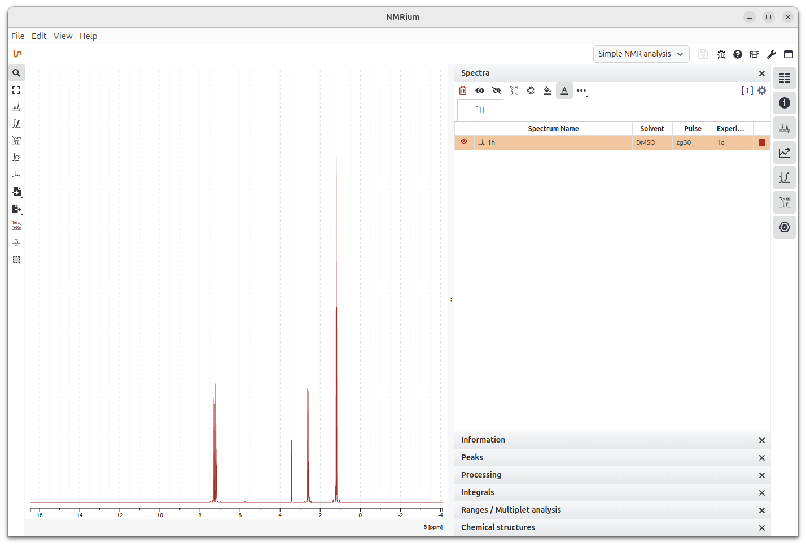

# NMRium Desktop

An Electron desktop wrapper around [NMRium](https://www.nmrium.org)
(cheminfo/nmrium), giving chemists a native install-and-open app — Start
Menu / Applications entry, a File → Open dialog, `.dx`/`.jdx` file
associations, and persistent local files — instead of a browser PWA install
flow.



## Features

- Native File → Open dialog and `.dx`/`.jdx` file-association double-click,
  wired into NMRium's own file-loading pipeline unmodified.
- NMRium's own drag-and-drop still works as-is.
- A native File → Open Sample menu (once the optional sample data is
  installed, see below) replaces NMRium's own in-app demo dataset picker.
- File → Save As (`.nmrium` archive) and Export as SVG, backed by NMRium's
  own `NMRiumRefAPI` (see "Native menu" below for what is and isn't
  reachable this way).
- File → Import Molecule… (`.mol`/`.sdf`) for NMRium's structure/atom-to-peak
  assignment panels — e.g. a molecule exported from Ketcher. Goes through
  the exact same delivery path as opening a spectrum; NMRium's own file
  loader already treats molecule files as a first-class input.
- View → Workspace menu exposing NMRium's built-in workspace presets
  (Default, 1D Processing, Prediction, Assignment, Simulation, Exercise,
  Embedded) — otherwise undiscoverable from inside the app itself.
- Help → About, crediting Zakodium/cheminfo per their license terms.
- No changes to NMRium's processing/rendering logic — it's built from source
  as a pinned git submodule. We render just the `<NMRium>` library
  component itself (via our own thin renderer, `renderer/`), not NMRium's
  demo/docs-site app — that app's routes, sample-picker sidebar, etc. are
  demo-site chrome we don't need and don't ship.

## Native menu — what's exposed and why

NMRium's own `NMRiumRefAPI` (the only supported way to reach into a mounted
`<NMRium>` from outside) is intentionally tiny: `loadFiles`,
`loadFileCollection`, `getNMRiumFile` (full `.nmrium` archive export), and
`getSpectraViewerAsBlob` (SVG only, no PNG). That caps what a native menu can
responsibly do:

- **Reachable, and wired up**: Open, Open Sample, Import Molecule, Save As,
  Export as SVG, Workspace switching (the `workspace` prop is live-reactive —
  no remount needed).
- **Not reachable, so not in the menu**: Undo/Redo (NMRium has no working
  undo/redo at all, even internally — it's dead reducer scaffolding
  upstream, marked `@todo`), individual panel/toolbar-button toggles
  (settable once via the `preferences`/`workspace` props at mount, not
  callable afterwards), PNG export/clipboard-copy, print, and other export
  formats (NMReData, JCAMP-DX, TSV) — all internal-only in NMRium's own
  toolbar.
- NMRium registers its own keyboard shortcuts on `Ctrl/Cmd+O/S/Shift+S/P/C`
  internally (`KeysListenerTracker.tsx`, `PrintContent.tsx`). Our native
  Open… keeps `CmdOrCtrl+O` (no observed conflict); Save As / Export as SVG
  deliberately have **no** accelerator to avoid an untested collision with
  NMRium's own in-page listeners for those same combinations.

## Requirements

- Node.js **24** (see `.nvmrc`) — matches the Node version NMRium itself
  pins via its own `.nvmrc`/Volta config.
- git (needed for the submodule).

## Getting started

```sh
git clone --recurse-submodules <this-repo-url>
cd nmrium-desktop
npm install
npm run build:nmrium   # installs the pinned NMRium submodule's own dependencies
npm start               # builds renderer/ then launches Electron
```

If you already cloned without `--recurse-submodules`:

```sh
git submodule update --init
```

## Building a packaged app

Local builds only target Linux (AppImage + deb) — that's what this machine
can run and test directly. Windows (nsis) and macOS (dmg) builds happen in
CI (GitHub Actions), not locally.

```sh
npm run dist
```

`package.json`'s `build.compression` is deliberately `"normal"`, not
`"maximum"` — do not "optimize" this back. AppImage mounts its payload as a
FUSE-backed squashfs at launch, and `"maximum"` (xz) compression measured
~60s to get a window on screen on a cold cache, vs. ~12s at `"normal"`,
for ~20MB more on disk. `.deb` installs are unaffected either way (dpkg
extracts to disk once at install time, no runtime decompression), so this
tradeoff only concerns the AppImage.

## Sample / teaching data (optional)

The packaged app ships without NMRium's own demo sample catalog (Cytisine,
ethylbenzene, teaching exercises, etc. — `nmrium/public/data` and
`/exercises`, ~250MB) since it's demo content for the public web app, not
something you need to open your own spectra. This is most of why the
installer is small.

`npm run build`/`npm run dist` always produce both companion packages
alongside the main app (`dist/nmrium-desktop-samples_<version>_all.deb` and
`dist/nmrium-samples.zip`) — they're a permanent part of the build, not an
opt-in extra step, so they're never at risk of getting lost in a clean
rebuild. Installing either is still optional and separate from the main app:

**Debian/Ubuntu — companion `.deb` (recommended on Linux):**

```sh
sudo apt install ./dist/nmrium-desktop-samples_2.3.0_all.deb
```

Installs system-wide to `/usr/share/nmrium-desktop/samples`, which the app
checks automatically. The main app's own `.deb` lists this package as a
`Suggests`, not a `Recommends`, so a plain `apt install nmrium-desktop`
never pulls it in automatically.

**Any OS — zip, extracted per-user:**

```sh
unzip dist/nmrium-samples.zip -d ~/.config/nmrium-desktop/samples   # Linux
```

(On macOS: `~/Library/Application Support/nmrium-desktop/samples`; on
Windows: `%APPDATA%\nmrium-desktop\samples`.) The app checks the per-user
copy first, then the system-wide `.deb` install, then falls back to the
(missing) bundled copy.

## Updating NMRium

```sh
npm run update-nmrium            # checks out the latest vX.Y.Z tag
# or: npm run update-nmrium -- v2.4.0
npm run build:nmrium             # rebuild and smoke-test before committing
git commit -am "chore: update NMRium to vX.Y.Z"
```

Upgrades are a deliberate, tested step — the submodule pointer is a commit
SHA, not a tracked branch.

## Architecture

```
nmrium-desktop/
├── electron/
│   ├── main.js      # BrowserWindow, app:// protocol, native menu, file-open/save IPC
│   └── preload.js   # feeds opened files into NMRium's own file input; contextBridge API for save/export/workspace
├── renderer/
│   ├── index.html
│   └── src/
│       ├── index.tsx              # mounts <NMRium ref/workspace> — no demo-app chrome
│       ├── electron-api.d.ts      # types for window.electronAPI
│       └── blueprint-icons-woff2.css
├── vite.config.js       # builds renderer/ against nmrium/src/component/main
├── scripts/
│   ├── build-nmrium.sh             # npm install inside nmrium/ (no build — see below)
│   ├── update-nmrium.sh
│   ├── build-samples-archive.sh   # optional nmrium-samples.zip (see below)
│   ├── build-samples-deb.sh       # optional nmrium-desktop-samples .deb (see below)
│   ├── generate-icons.cjs         # build/icon.png -> build/icons/{16..1024}x*.png (via Electron's nativeImage)
│   └── appimage-wrap.cjs          # afterPack: force --no-sandbox, strip dead weight, on Linux
├── build/
│   ├── icon.png     # app icon SOURCE — NMRium's own brand mark (from nmrium.com/brand)
│   └── icons/       # GENERATED by generate-icons.cjs, gitignored — do not hand-edit
├── nmrium/          # git submodule -> github.com/cheminfo/nmrium, pinned to v2.3.0
└── package.json     # electron-builder config lives here
```

`renderer/` is our own minimal Vite app: it imports the `NMRium` component
directly from `nmrium/src/component/main` (the actual library source, not
NMRium's demo/docs-site build) and mounts it with no other chrome. This
means `npm run build:nmrium` only needs to install the submodule's
dependencies — its own `npm run build` (which builds the demo app: routing,
sample-picker sidebar, etc.) is never invoked. `vite.config.js` sets
`resolve.dedupe` for react/react-dom/blueprint/react-science so our renderer
entry and NMRium's internals share a single copy of each, since the
submodule's own `node_modules` also carries them (as its devDependencies
for building its demo app).

The renderer build output (`renderer/dist`) is served through a custom
`app://` protocol rather than `file://`, for secure-context treatment
consistent with what NMRium expects. Native File → Open (and File → Open
Sample, once sample data is installed) reads the file in the main process
and delivers it to NMRium's existing hidden file input (the same one its
own drag-and-drop UI uses), rather than modifying NMRium's source. Save
As/Export as SVG go the other direction — main asks the renderer (over a
`contextBridge`-exposed `window.electronAPI`, since there's no DOM element
to drive for these) to compute the export via `NMRiumRefAPI`, which hands
the bytes back for `dialog.showSaveDialog` + a plain file write.

### App icon on Linux

Two easy-to-regress gotchas, both required for the app to actually show its
own icon (taskbar/dash/Alt-Tab) instead of a generic one:

- `BrowserWindow`'s `icon` option needs a loaded `nativeImage`, not a raw
  path string — the latter silently produces an empty `_NET_WM_ICON`.
- Electron's runtime `WM_CLASS` is derived from `package.json`'s `name`
  field (`nmrium-desktop`), **not** `productName` (`NMRium Desktop`). GNOME
  Shell (and others) match a running window to its `.desktop` file via
  `StartupWMClass`, so that field is explicitly overridden in
  `build.linux.desktop.StartupWMClass` to match — electron-builder's
  default (`productName`) would otherwise never match, silently falling
  back to a generic icon with no error anywhere. Also note: under a native
  Wayland session (not XWayland fallback), `_NET_WM_ICON` may stay empty
  even when everything is correctly configured — GNOME resolves the icon via
  the matched `.desktop` file instead, so that alone isn't a sign of failure.

## Development

```sh
npm start
```

Reload with the View menu / devtools for debugging the loaded NMRium build.

## License

MIT, matching upstream NMRium. NMRium is developed by
[Zakodium](https://www.zakodium.com)/cheminfo (with EU Horizon 2020 grant
funding) — see [nmrium/LICENSE](nmrium/LICENSE) and
https://github.com/cheminfo/nmrium for the upstream project.

The packaged app omits Chromium's own bundled `LICENSES.chromium.html`
(~12MB, purely informational, not read at runtime) to keep install size
down — see https://www.chromium.org/Home for upstream Chromium's own
third-party license notices if needed.
